### [Django教程]()

#### 1.Django简介

##### 1.1Django版本

不同的Django版本对应不同的Python版本，安装时要注意避免不可兼容的问题，比如：2.1，2.2（Django）—3.5，3.6，3.7(Python)

##### 1.2Django基本介绍

Django本身是基于MVC模型设计模式，它能够支持的架构模式还有MTV模型。

###### 1.2.1MVC模型

该模型将软件系统分为三个基本部分：模型（Model）、视图（View）、控制器（Controller）

模型（M）- 编写程序应有的功能，负责业务对象与数据库的映射（ORM）。

视图（V）- 图形界面，负责与用户的交互。

控制器（C）- 负责转发请求，对请求进行处理。

用户操作流程图：

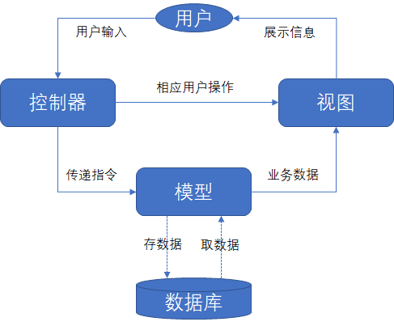

###### 1.2.1MTV模型

模型（M）- 编写程序应有的功能，负责业务对象与数据库的映射（ORM）。

模板（Template）:负责如何把页面（html）展示给用户。

视图（V）-负责业务逻辑，并在适当的时候调用Model和Template。

除了以上三层之外，还需要一个URL分发器，作用是将一个个URL的页面分发器发送给不同的View，View再调用相应的model和Template。

简易图：

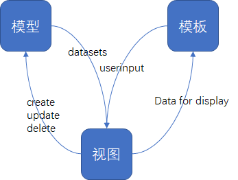

用户操作流程图：

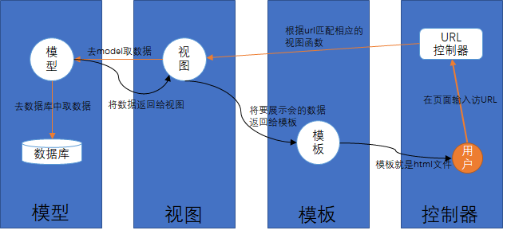

#### 2.Django安装

- 在window中先需要安装python环境，之后安装Django。
- 在pycharm中安装Django，可以在setting中进行添加。

#### 3.创建第一个项目

使用django-admin，在使用之前需要先在系统环境变量中添加python和Django环境变量。

```python
#创建项目
django-admin startproject HelloWorld
进行项目文件夹，开启服务
python3 manage.py runserver 0.0.0.0:8000
之后在浏览器中输入本机地址：127.0.0.1:8000
!!!在这可能会出现的问题：cmd 运行 python3 manage.py runserver 0.0.0.0:8000 无反应
    检查py -m django --version 版本
    若django大于3.0版本
    则开启服务要执行 py manage.py runserver
```

在urls文件中path的用法：

```
path(route, view, kwargs=None, name=None)
route: 表示URL规则， 与之匹配的URL会执行对应的第二个参数
view：用于执行与正则表达式匹配的URL请求
kwargs： 视图使用的字典类型参数
name： 用来反向获取URL
```

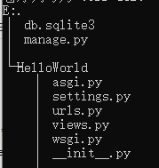

#### 4.Django模板

在第3节中项目的views.py（视图）中将数据和视图混合在一起，不符合MVC思想，因此引出”模板“，模板是一个文本，用于分离文档的表现形式和内容。

##### 4.1 模板应用的基本流程

- 建立模板文件，放在templates目录中， templates目录与manage.py同级

```html
<h1>{{ hello }}</h1>
```

- 向Django说明模板文件的路径，在配置文件（setting.py）中设置

```python
TEMPLATES = [
    {
        'BACKEND': 'django.template.backends.django.DjangoTemplates',
        'DIRS': [os.path.join(BASE_DIR,'templates')],#该处修改位置,templates是模板文件所在的文件夹
        'APP_DIRS': True,
        'OPTIONS': {
            'context_processors': [
                'django.template.context_processors.debug',
                'django.template.context_processors.request',
                'django.contrib.auth.context_processors.auth',
                'django.contrib.messages.context_processors.messages',
            ],
        },
    },
]
```

- 修改视图（views.py），向模板提交数据：runoob.html中的hello对应了context键值的hello

```python
from django.shortcuts import render

def runoob(request):
	context={}
	context['hello']='Hello World!'
	return render(request,'runoob.html',context)
```

- 修改urls.p文件

```python
from django.urls import path
from .  import views

urlpatterns = [
    path('runoob/', views.runoob),
]
```

- 运行

##### 4.2 Django模板标签

###### 4.2.1 变量

```python
views:{"HTML变量名":"views变量名"}
HTML:{{变量名}}
```

实例：

views.py

```python
from django.shortcuts import render

def runoob(request):
	view_name="菜鸟教程"
	return render(request,"runoob.html",{"name":view_name})
```

templates中runoob.html

```html
<h1>{{ name }}</h1>
```

###### 4.2.2 列表

用 **.** 索引下标取出对应的元素

views.py

```python
from django.shortcuts import render

def runoob(request):
	view_list=["菜鸟教程1","菜鸟教程2"]
	return render(request,"runoob.html",{"name":view_list})
```

templates中runoob.html

```html
<h1>{{ name.0 }}</h1>
<h1>{{ name.1 }}</h1>
```

###### 4.2.3 字典

用 **.键** 取出对应的值

views.py

```python
from django.shortcuts import render

def runoob(request):
	view_dict={"name":"菜鸟教程"}
	return render(request,"runoob.html",{"view_dict":view_dict})
```

templates中runoob.html

```html
<h1>{{ view_dict.name }}</h1>
```

###### 4.2.4 过滤器

过滤器是指在变量显示给模板前，对变量先进行操作，比如可以先进行字符串大小写的转换、时间格式的变换……

文档大写转换为小写（lower），views.py

```python
from django.shortcuts import render

def runoob(request):
	name="Lin Hexiu"
	return render(request,"runoob.html",{"name":name})
```

templates中runoob.html

```html
<h1>{{ name }}</h1>
<h1>{{ name|lower }}</h1>
```

说明：

- 过滤管道可以进行“套接”，比如 {{ name|first|upper }} 将第一个元素变成大写并输出
- 其他过滤器：
  - truncatewords:"参数"：显示变量前“参数”个字符
  - addslashes:添加反斜杠到任何反斜杠、单引号、双引号前面
  - date:按指定的格式字符串参数格式化 date 或者 datetime 对象
  - length:返回字符串的长度
  - default:为变量提供一个默认值
  - filesizeformat:以更易读的方式显示文件的大小
  - truncatechars:“参数”:截取参数个字符
  - safe:将字符标记为安全，不需要转义，比如说链接，实例如下

views.py

```python
from django.shortcuts import render

def runoob(request):
	views_str="<a href='https://www.baidu.com'>点击跳转</a>"
	return render(request,"runoob.html",{"views_str":views_str})
```

html

```html
<h1>{{ views_str|safe }}</h1>
```

###### 4.2.5 if/else 标签

views.py

```python
from django.shortcuts import render

def runoob(request):
	views_num=57
	return render(request,"runoob.html",{"num":views_num})
```

templates中runoob.html

```html

优秀

合格

不合格

```

###### 4.2.6 for 标签

views.py

```python
from django.shortcuts import render

def runoob(request):
	views_list=["test1","test2","test3"]
	return render(request,"runoob.html",{"views_list":views_list})
```

templates中runoob.html

```html

{{ i }}

```

###### 4.2.7 ifequal/ifnotequal 标签

比较两个值，当他们相等/不相等时，值显示中间

###### 4.2.8 注释标签

```html
{#这是一个注释标签#}
```

###### 4.2.8 include标签

该标签允许在模板中包含其它模板的内容

```html

```

###### 4.2.9 csrf_token

用于form表单中，作用是跨站请求伪造保护

###### 4.2.10 自定义标签和过滤器

- 在应用目录下创建templatetags目录，与template同级

- 在templatetags目录下创建my_tags.py

- 配置setting.py文件

  ```python
  TEMPLATES = [
      {
          'BACKEND': 'django.template.backends.django.DjangoTemplates',
          'DIRS': [os.path.join(BASE_DIR, 'templates')],
          'APP_DIRS': True,
          'OPTIONS': {
              'context_processors': [
                  'django.template.context_processors.debug',
                  'django.template.context_processors.request',
                  'django.contrib.auth.context_processors.auth',
                  'django.contrib.messages.context_processors.messages',
              ],
              "libraries":{
                  'my_tags':'templatetags.my_tags'#添加my_tags
              }
          },
      },
  ]
  ```

- my_tags.py文件代码如下

  ```python
  from django import template
  
  register=template.Library() #register的名字是固定的，不可改变的
  #利用装饰器@register.filter自定义过滤器，参数只能有两个
  @register.filter
  def my_filter(v1,v2):
  	return v1*v2
  #用@register.simple_tag自定义标签
  @register.simple_tag
  def my_tag1(v1,v2,v3):
  	return v1*v2*v3
  ```

- 在HTML中使用过滤器和标签

  ```html
   #导入py文件
  {{ 11|my_filter:22 }} #使用过滤器
   #使用标签
  ```

###### 4.2.11 配置静态文件

在templates同级目录下，建立statics目录，用来存放静态资源

在setting.py中，在最下方加上这些语句

```python
STATIC_URL='/static/'#别名
STATICFILES_DIRS-{
    os.path.join(BASE_DIR, "statics")
}
```

###### 4.2.12 模板继承

可以通过继承的方式来实现复用，减少冗余

#### 5.Django模型

##### 5.1  ORM简介

- Django模型自带ORM，对象关系映射（Object Relational Mapping）用于实现面向对象编程语言里不同类型的数据之间的转换
- ORM在业务逻辑层和数据层之间充当了桥梁作用
- ORM通过使用描述对象和数据库之间的映射的元数据，将程序中的对象自动持久化到数据库中。

##### 5.2 ORM解析过程

- ORM将python代码转换为SQL语句
- SQL语句通过pymysql传送到数据库服务端
- 在数据库中执行SQL语句并将结果返回

ORM对应关系表如下图：

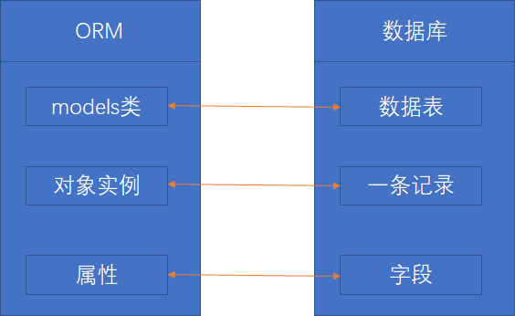

##### 5.3 Django操作Mysql

###### 5.3.1 数据库配置

如果没安装 mysql 驱动，执行以下命令进行驱动安装

```python
pip install pymysql
```

Django不能执行创建数据库操作，只能操作到数据表，因此建库需要在到mysql的可视化软件中进行操作，也可以cmd进行建库

进入到安装mysql的bin目录下

```python
mysql -uroot -p
输入密码，进入mysql界面
create database runoob default charset utf8; #这里末尾的 ; 不能漏
```

建库完，到setting下进行配置

```python
DATABASES = {
    'default': {
        # 'ENGINE': 'django.db.backends.sqlite3', 
        # 'NAME': BASE_DIR / 'db.sqlite3',
        'ENGINE': 'django.db.backends.mysql', #数据库引擎
        'NAME': 'runoob', #数据库名称
        'HOST':'127.0.0.1', #数据库地址
        'PORT':3306, #端口
        'USER':'root', #数据库用户名
        'PASSWORD':'1234', #数据库密码
    } 
}
```

之后到setting同一级目录下的 **__init__.py** 中引入模块进行配置

```python
import pymysql
pymysql.install_as_MySQLdb()
```

###### 5.3.2 定义模型

Django规定，如果要用模型，则必须要建一个app，接下来建立一个名为TestModel的app

进入项目一级目录，即manage.py所在的目录

```
python manage.py startapp TestModel
```

生成app目录之后，里面由很多py文件，其中有models.py，用来操作数据库中数据表

```python
from django.db import models

# Create your models here.
class Test(models.Model):
	name=models.CharField(max_length=20)#类里面的字段代表数据表中的字段（name）,数据类型CharField（相当于varchar）,max_length限定长度
```

修改setting.py

```python
INSTALLED_APPS = [
    'django.contrib.admin',
    'django.contrib.auth',
    'django.contrib.contenttypes',
    'django.contrib.sessions',
    'django.contrib.messages',
    'django.contrib.staticfiles',
    'TestModel',#在这添加app目录名
]
```

cmd到项目manage.py目录,，进行建表

```
python manage.py makemigrations TestModel #让Django知道我们的模型是有变化的
python manage.py migrate TestModel #创建表结构
```

###### 5.3.3 数据库操作

- 添加操作

在Test容器下，建立testdb.py

```python
from django.http import HttpResponse
from TestModel.models import Test

#数据库操作
def testdb(request):
	test1=Test(name='runoob')
	test1.save()
	return HttpResponse("<p>数据添加成功！</p>")
```

为了说明它添加成功，在urls.py中设置

```python
from django.urls import path
from . import views,testdb

urlpatterns = [
    path('runoob/', views.runoob),
    path('testdb/', testdb.testdb),
]
```

运行 **127.0.0.1:8000/testdb/** 出来 **数据添加成功！**

- 获取数据

```python
#获取数据
def testdb(request):
	#初始化
	response=""
	response1=""

	list=Test.objects.all()#相当于SQL中SELECT * FROM
	response2=Test.objects.filter(id=1)#相当于SQL中WHERE
	response3=Test.objects.get(id=1)#获取单个对象
	Test.objects.order_by('name')[0:2]#限制返回的数据，相当于SQL中的OFFSET 0 LIMIT 2
	Test.objects.order_by("id")#数据排序
	Test.objects.filter(name='runoob').order_by("id")#方法可以连锁使用

	#输出数据
	for var in list:
		response1+=var.name+" "
	response=response1
	return HttpResponse("<p>"+response+"</p>")
```

- 更新数据

```python
#更新数据
def testdb(request):
	test1=Test.objects.get(id=1)
	test1.name='Google'
	test1.save()

	#Test.objects.filter(id=1).update(name='Google')
	#修改所有的列
	#Test.objects.all().update(name='Google')

	return HttpResponse("<p>修改成功！</p>")
```

- 删除数据

```python
#删除数据
def testdb(request):
	test1=Test.objects.get(id=1)
	test1.delete()

	#Test.objects.filter(id=1).delete()
	#删除所有数据
	#Test.onjects.all().delete()
	return HttpResponse("<p>删除成功！</p>")
```

#### 6.Django表单

##### 6.1 HTTP请求

###### 6.1.1 GET方法

在Test容器中建立一个search.py文件，用于接收用户请求

```python
from django.http import HttpResponse
from django.shortcuts import render

#表单
def search_form(request):
	return render(request,'search_form.html')

#接受请求数据
def search(request):
	request.encoding='utf-8'
	if 'q' in request.GET and request.GET['q']:
		message='你搜索的内容为：'+request.GET['q']
	else:
		message='你提交了空表单'
	return HttpResponse(message)

```

在search.py中有search_form.html，因此在模板目录下要建立search_form.html

```html
<form action="/search/" method="get">
	<input type="text" name="q">
	<input type="submit" value="搜索">
</form>
```

urls.py中路径修改一下

```python
from django.conf.urls import url
from . import views,testdb,search

urlpatterns = [
    url(r'testdb/$', testdb.testdb),
    url(r'search_form/$', search.search_form),
    url(r'search/$', search.search),
]
```

###### 6.1.2 POST方法

在模板中建立post.html

```html
<form action="/search-post/" method="post">
	
	<input type="text" name="q">
	<input type="submit" value="搜索">
</form>

<p>{{ rlt }}</p>
```

在Test容器中建立一个search2.py文件，用于接收用户请求

```python
from django.shortcuts import render
from django.views.decorators import csrf

def search_post(request):
	ctx={}
	if request.POST:
		ctx['rlt']=request.POST['q']
	return render(request,"post.html",ctx)
```

urls.py中路径修改一下

```python
from django.conf.urls import url
from . import views,testdb,search,search2

urlpatterns = [
    url(r'^testdb/$', testdb.testdb),
    url(r'^search-form/$', search.search_form),
    url(r'^search/$', search.search),
    url(r'^search-post/$', search2.search_post),
]
```

##### 6.2 Request对象

每个视图函数的第一个参数是一个HttpRequest对象

#### 7.Django视图

##### 7.1 视图层

- 每一个视图都负责一个HttpRequest对象，对象中包含生成的响应
- 视图层中有两个重要的对象，请求对象（request）和相应对象（HttpResponse）

##### 7.2 请求对象

HttpRequest对象（简称request对象）

###### 7.2.1 GET

```python
包含HTTP GET 的所有参数
取值格式：对象.方法
实例：
def runoob(request):
	name=request.GET.get("name")
	return HttpResponse('姓名：{}'.format(name))
```

###### 7.2.2 POST

```python
包含HTTP POST 的所有参数
常用于表单，form表单里的标签name属性对应参数的键，value属性对应参数的值
取值格式：对象.方法
实例：
def runoob(request):
	name=request.POST.get("name")
	return HttpResponse('姓名：{}'.format(name))
```

###### 7.2.3 body

```python
数据类型是二进制字节流，处理二进制图片、Json等非常有用
实例：
def runoob(request):
	name=request.body
	print(name)
	return HttpResponse("菜鸟教程")
```

###### 7.2.4 path

```python
获取URL的路径，数据类型是字符串
实例：
def runoob(request):
	name=request.path
	print(name) #输出/runoob/
	return HttpResponse("菜鸟教程")
```

###### 7.2.5 method

```python
获取当前请求的方式，数据类型是字字符串，结果为大写
实例：
def runoob(request):
	name=request.method
	print(name)#输出GET/POST
	return HttpResponse("菜鸟教程")
```

##### 7.3 响应对象

响应对象主要有三种形式：HttpResponse()、render()、redirect()

###### 7.3.1 HttpResponse()

返回文本，参数为字符串，字符串写文本内容。如果参数为字符串里含有html标签，也可以进行渲染

###### 7.3.2 render()

返回文本，第一个参数为request，第二个参数为字符串，第三个参数为字典（是可选参数，键为页面参数，值为views参数名）

```python
def runoob(request):
	name="菜鸟教程"
	return render(request,"runoob.html",{"name":name})
```

###### 7.3.3 redirect()

重定向，跳转新页面。

```python
def runoob(request):
	return redirect("/index/")
```

#### 8.Django路由

- 路由简单来说，就是根据用户请求的URL链接来判断对应的处理程序，并返回处理结果，即URL和Django之间建立映射关系

- Django路由在urls.py中配置

- 不同版本的Django的urls.py配置不一样

  - Django1.1.x 版本

    ```python
    url()方法：普通路径和正则路径均可使用，需要手动添加正则首位限制符号
    from django.conf.urls import url #引入urls
    
    urlpatterns=[
        url(r'^admin/$',admin.site.urls),
        url(r'^index/$',views.index), #普通路径
        url(r'^articles/([0-9]{4})/$',view.articles), #正则路径  
    ]
    ```

  - Django2.2.x 版本

    ```python
    path()方法：用于普通路径，不需要手动添加正则首位限制符号
    re_path()方法：用于正则路径，需要手动添加正则首位限制符号
    from django.urls import re_path
    
    urlpatterns=[
        path('admin/',admin.site.urls),
        path('index/',views.index),
        re_path(r'^articles/([0-9]{4})/$',view.articles),
    ]
    ```

#### 9.Django Admin管理工具

Django自动管理工具是django.contrib中的一部分，可以在setting.py 中的INSTALLED_APPS看到它。

##### 9.1 激活管理工具

在urls.py中配置以下代码

```python
from django.conf.urls import url
from django.contrib import admin

urlpatterns=[
    url(r'^admin/',admin.site.urls),
]
```

##### 9.2 使用管理工具

启动服务器，在浏览器中打开**127.0.0.1:8000/admin/**， 出来以下界面

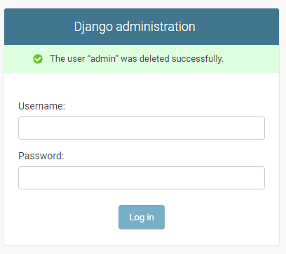

之后进入manage.py所在的目录文件，添加超级用户

```cmd
python manage.py createsuperuser

说明：如果在创建超级用户时出现以下错误时，解决方案如下：
①1146, “Table ‘django_session’ doesn’t exist”
在cmd中分别执行 
python manage.py makemigration session
python manage.py migrate session

②1146, “Table ‘auth_user’ doesn’t exist”
在cmd中分别执行 
python manage.py makemigration
python manage.py migrate 
```

添加之后，实现超级用户的登录

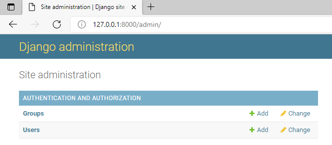

为了让admin界面管理某个数据模型，需要先将数据模型注册到admin中，之前我们已经有TestModel的app，里面创建了Test模型，修改TestModel里面admin.py

```python
from django.contrib import admin
from TestModel.models import Test

# Register your models here.

admin.site.register(Test)
```

再次打开时，TESTMODEL就被加载进来了

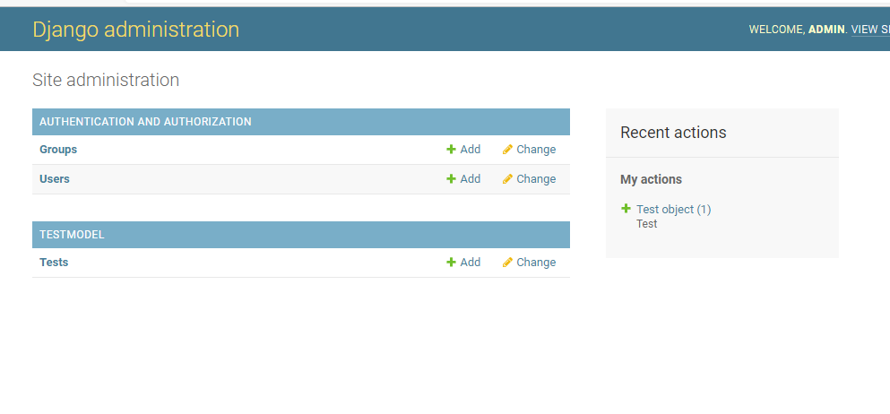

##### 9.3 复杂模型

复杂模型是指admin可以同时管理models.py里的多个模型（数据库中的多张表）

现在models.py中添加两张表（一共有三张表，之前建立了Test模型）

```python
from django.db import models

# Create your models here.
class Test(models.Model):
	name=models.CharField(max_length=20)

class Contact(models.Model):
	name=models.CharField(max_length=200)
	age=models.IntegerField(default=0)
	email=models.EmailField()
	def __unicode__(self):
		return self.name


class Tag(models.Model):
	contact=models.ForeignKey(Contact, on_delete=models.CASCADE,)
	name=models.CharField(max_length=50)
	def __unicode__(self):
		return self.name
```

通过cmd在数据库中创建这三张表

```cmd
python manage.py makemigrations TestModel
python manage.py migrate TestModel
```

在admin.py中添加这三张表

```python
from django.contrib import admin
from TestModel.models import Test,Contact,Tag

# Register your models here.
 
admin.site.register([Test,Contact,Tag])
```

运行结果如下图

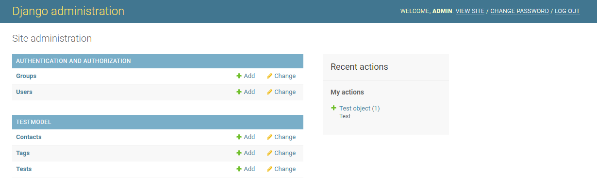

##### 9.4 自定义表单

之间来设置管理页面，改变原来默认的页面，

- 实例1：比如在Contact模型的add页面只显示name和email，可以这样设置，在admin.py中

```python
from django.contrib import admin
from TestModel.models import Test,Contact,Tag

# Register your models here.

class ContactAdmin(admin.ModelAdmin):
	fields=('name','email')#定义了一个类，说明管理页面的显示格式

admin.site.register(Contact,ContactAdmin)
admin.site.register([Test,Tag])
```

实现效果

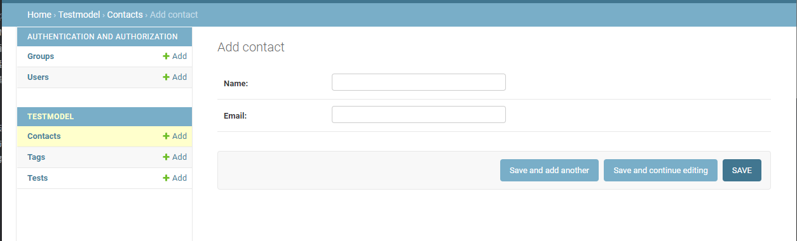

实例2：分栏展示，在admin.py中

```python
# Register your models here.

class ContactAdmin(admin.ModelAdmin):
	fieldsets=(
		['Main',{
			'fields':('name','email'),
		}],
		['Advance',{
			'classes':('collapse'),#CSS
			'fields':('age',),
		}]
		)

admin.site.register(Contact,ContactAdmin)
admin.site.register([Test,Tag])
```

实现效果

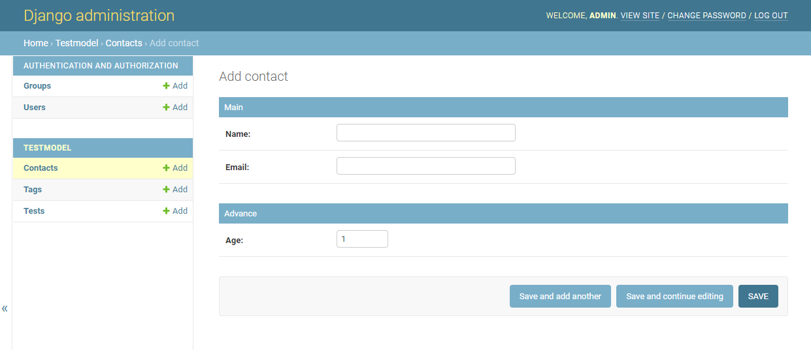

##### 9.5 内联（Inline）显示

实现内联的原因：Contact时Tag的外键，为了体现两者的关系，将两者放在同一页面中

admin.py文件代码

```python
from django.contrib import admin
from TestModel.models import Test,Contact,Tag

# Register your models here.
# 
class TagInline(admin.TabularInline):
	model=Tag

class ContactAdmin(admin.ModelAdmin):
	inlines=[TagInline]
	fieldsets=(
		['Main',{
			'fields':('name','email'),
		}],
		['Advance',{
			'classes':('collapse'),#CSS
			'fields':('age',),
		}]
		)

admin.site.register(Contact,ContactAdmin)
admin.site.register([Test])
```

实现效果

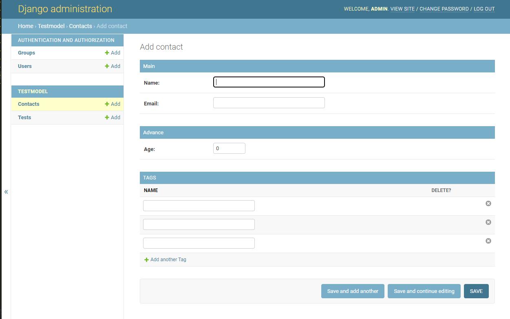

##### 9.6 列表页显示

实现Contact数据列表展示同时有搜索功能

admin.py文件代码

```python
from django.contrib import admin
from TestModel.models import Test,Contact,Tag

# Register your models here.
# 
class TagInline(admin.TabularInline):
	model=Tag

class ContactAdmin(admin.ModelAdmin):
	list_display=('name','age','email')#列表展示
	search_fields=('name',)#搜索功能
	inlines=[TagInline]
	fieldsets=(
		['Main',{
			'fields':('name','email'),
		}],
		['Advance',{
			'classes':('collapse'),#CSS
			'fields':('age',),
		}]
		)

admin.site.register(Contact,ContactAdmin)
admin.site.register([Test])
```

实现效果

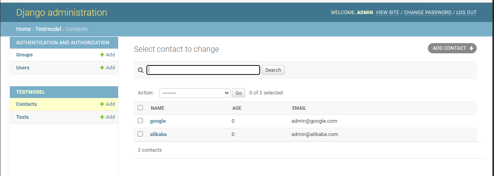

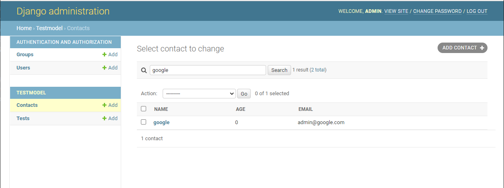

#### 10.单表实例

##### 10.1 数据库添加

方式1：实例化对象之后执行**对象.save()**

```python
from django.shortcuts import render,HttpResponse
from app01 import models
def add_book(request):
	book=models.Book(title='菜鸟教程',price=300,publish='菜鸟出版社',pub_date="2021-12-10")
	book.save()
	return HttpResponse("<p>查找成功！</p>")
```

方式2：通过ORM提供的objects提供的create方法来实现

```python
from django.shortcuts import render,HttpResponse
from app01 import models
def add_book(request):
	book=models.Book.objects.create(title='菜鸟教程',price=300,publish='菜鸟出版社',pub_date="2021-12-10")
	return HttpResponse("<p>查找成功！</p>")
```

##### 10.2 数据库查找

```python
all()：books=models.Book.objects.all()
filter():books=models.Book.objects.filter(pk=5)
exclude():查询不符合条件的数据
get():查询符合条件的对象，该对象只能由一个，超出或者没有都会报错
order_by(): 
	升序：book=models.Book.objects.order_by("price")
	降序：book=models.Book.objects.order_by("-price")
reverse():对查询结果进行反转
count():查询数据的数量返回的数据是整数
first():返回所有数据的第一条数据
last():返回所有数据的最后一条数据
exist():判断查询结果QuerySet是否有数据

values():查询部分字段的数据，不是对象而是数据
values_list():查询某个字段相对应的数据，得到的是一个元组

distinct():去重
——gt:大于号 books=models.Book.objects.filter(price__gt=200)
__gte:大于等号
__lt:小于号
__lte:小于等于
__range:左闭右闭区间
__contains:包含 book=models.Book.objects.filter(title__contains="菜"）
__icontains:不区分大小写的包含
__startwith:以指定的字符开头
__endwith:以指定的字符结束
__year:是DateField数据类型的年份
__month:是DateField数据类型的月份
__day:是DateField数据类型的天数
```

##### 10.3 数据库删除

- 对象.delete()
- 数据类型.delete()

##### 10.4 数据库修改

方式1：

```python
book=models.Book.objects.filter(pk=7).first()
book.price=400
book.save()
```

方式2：

```
book=models.Book.objects.filter(pk__in=[7,8]).update(price=888)
```

#### 11.多表实例
